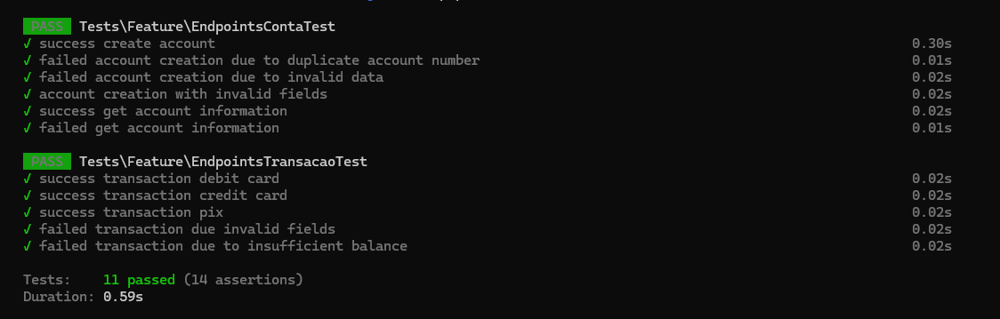

# Endpoints - Conta Bancária

> Esse repositório é um desafio técnico para vaga de Desenvolvedor Back-End PHP

## Ambiente de desenvolvimento
- Laravel 10.48
- PHP 8.1
- Mysql
- Docker

## Instruções

1. Para rodar esse projeto basta executar esse comando dentro de uma pasta da sua escolha `git clone https://github.com/ham1lts/project_laravel.git`
2. Copie o arquivo `.env.example` para o arquivo `.env` 
3. Execute o comando `docker-compose build` e em seguida `docker-compose up -d`
4. Execute o comando `docker exec web_service_backend php artisan migrate` para aplicar as mudanças no banco de dados.

## Case

Desenvolva um sistema de gestão bancária utilizando uma API, composta por dois endpoints:

- `/conta`, que será responsável pela criação de contas e fornecimento de informações relacionadas ao número da conta;
- `/transacao`, que deverá realizar operações financeiras.

## Requisitos

- Padrões de Entrada e Saída dos Endpoints (Formato JSON)

As seguintes siglas devem ser usadas para as formas de pagamento:

    P: Pix
    C: Cartão de Crédito
    D: Cartão de Débito

### **POST /api/conta**
#### Corpo da Requisição (Request Body)

O corpo da requisição deve ser enviado no formato JSON e deve conter os seguintes parâmetros obrigatórios:

- **numero_conta** (string, obrigatório): O número da conta a ser adicionada.
- **saldo** (número, obrigatório): O saldo inicial da conta.

#### Entrada (Body)

```json
{
    "numero_conta": "254",
    "saldo": 180.50
}
```

### **GET /api/conta**
Este endpoint recupera as informações de uma conta específica com base no número da conta fornecido como parâmetro de consulta.

#### Parâmetros da Requisição

- **numero_conta** (parâmetro de consulta, obrigatório): O número da conta para a qual as informações devem ser recuperadas.

#### Exemplo de Requisição

```php
curl -X GET "http://localhost:8000/api/conta?numero_conta=254"
```

### **POST /api/transacao**
Realização de uma transação financeira

#### Corpo da Requisição (Request Body)

O corpo da requisição deve ser enviado no formato JSON e deve conter os seguintes parâmetros obrigatórios:

- **forma_pagamento** (string, obrigatório): A forma de pagamento utilizada para a transação.  
  **Exemplos**: `"P"` (Pix), `"C"` (Cartão de Crédito), `"D"` (Cartão de Débito).
- **numero_conta** (número, obrigatório): O número da conta para a qual a transação será realizada.
- **valor** (número, obrigatório): O valor da transação.

#### Exemplo de Requisição

```json
{
    "forma_pagamento": "D",
    "numero_conta": 254,
    "valor": 50.00
}
```

> Casos de Teste
>> `test_success_create_account` 
>> 
>> Objetivo: Validar a criação bem-sucedida de uma nova conta.
>> 
>> Comportamento Esperado: A conta deve ser criada com os dados fornecidos (número da conta e saldo) e o servidor deve retornar o status HTTP 201 Created.
>> 
>> Descrição: Esse teste cobre o caso onde os dados enviados são válidos e a conta é criada com sucesso.
>
>> `test_failed_account_creation_due_to_duplicate_account_number`
>>
>> Objetivo: Validar a falha na criação de uma conta devido à duplicidade no número da conta.
>>
>> Comportamento Esperado: Quando a tentativa de criar uma nova conta com um número de conta já existente for feita, a resposta deve ser 400 Bad Request, indicando que o número da conta é duplicado.
>>
>> Descrição: Esse teste cobre o cenário onde a criação de uma conta é solicitada, mas o número da conta já existe no banco de dados. Nesse caso, o sistema deve retornar um erro informando a duplicidade.
 >
>> `test_failed_account_creation_due_to_invalid_data`
>>
>> Objetivo: Validar a falha na criação de uma conta devido a dados inválidos fornecidos.
>>
>> Comportamento Esperado: Quando um número de conta inválido (não numérico) é fornecido, o servidor deve retornar o status HTTP 422 Unprocessable Entity, indicando que os dados são inválidos.
>>
>> Descrição: Esse teste cobre o caso onde os dados fornecidos para a criação da conta não atendem às validações esperadas (exemplo: o número da conta deve ser um número inteiro).
> 
>> `test_account_creation_with_invalid_fields`
>>
>> Objetivo: Validar a falha na criação de uma conta quando campos não esperados são fornecidos.
>> 
>>Comportamento Esperado: Se um campo desconhecido for incluído na solicitação, o servidor deve retornar o status 422 Unprocessable Entity indicando que o campo não é válido.
>> 
>>Descrição: Esse teste simula a inclusão de um campo aleatório (RANDOM_FIELD) que não existe no modelo da conta, o que deve resultar em um erro de validação.
>
>> `test_success_get_account_information`
>>
>> Objetivo: Validar a recuperação bem-sucedida das informações de uma conta.
>> 
>>Comportamento Esperado: A conta com o número 85596 deve ser recuperada com sucesso, e a resposta deve retornar os dados da conta (numero_conta e saldo) com o status 200 OK.
>> 
>>Descrição: Este teste valida o cenário em que uma solicitação GET é feita para recuperar as informações de uma conta existente.
>
>> `test_failed_get_account_information`
>>
>> Objetivo: Validar a falha na recuperação de informações de uma conta inexistente.
>> 
>>Comportamento Esperado: Quando a conta solicitada não existir, a API deve retornar o status HTTP 404 Not Found, indicando que a conta não foi encontrada.
>> 
>>Descrição: Esse teste cobre o caso onde uma solicitação é feita para recuperar informações de uma conta que não existe no sistema. O servidor deve retornar um erro 404.
> 
>> `test_success_transaction_debit_card`
>> 
>> Objetivo: Validar a transação bem-sucedida com pagamento via débito.
>>
>> Comportamento Esperado: A transação de débito deve ser processada com sucesso, descontando o valor correto da conta e retornando o status 201 Created.
>>
>> Descrição: Este teste cobre o cenário onde uma transação é feita usando a forma de pagamento débito ("D") para uma conta previamente criada com saldo suficiente.
> 
>> test_success_transaction_credit_card
>>
>> Objetivo: Validar a transação bem-sucedida com pagamento via crédito.
>>
>> Comportamento Esperado: A transação de crédito deve ser processada corretamente, com o valor adequado sendo debitado da conta, retornando o status 201 Created.
>>
>> Descrição: Esse teste cobre o caso em que uma transação com pagamento via crédito ("C") é realizada em uma conta válida e com saldo suficiente.
>
>> `test_success_transaction_pix`
>>
>> Objetivo: Validar a transação bem-sucedida com pagamento via PIX.
>>
>> Comportamento Esperado: A transação via PIX deve ser processada com sucesso, considerando o valor total do saldo da conta, e retornar o status 201 Created.
>>
>> Descrição: Este teste valida o caso em que uma transação PIX é realizada, com o valor da transação igual ao saldo total da conta.
>
>> `test_failed_transaction_due_invalid_fields`
>> 
>> Objetivo: Validar a falha na transação devido ao envio de campos inválidos ou incorretos.
>>
>> Comportamento Esperado: Quando campos inválidos são enviados na requisição (como um campo desconhecido ou valor inválido), a API deve retornar o status 422 Unprocessable Entity para cada caso de erro.
>>
>> Descrição: Este teste cobre diferentes cenários em que campos inválidos são passados na requisição, como:
>>- Um campo inválido (RANDOM_FIELD).
>>-  Forma de pagamento inválida.
>>-  Valor da transação negativo.
> 
>> `test_failed_transaction_due_to_insufficient_balance`
>>
>> Objetivo: Validar a falha na transação devido a saldo insuficiente na conta.
>>
>> Comportamento Esperado: Quando o valor da transação for superior ao saldo disponível na conta, a API deve retornar o status 404 Not Found, indicando que a transação não pode ser processada.
>>
>> Descrição: Este teste cobre o cenário onde o saldo da conta não é suficiente para realizar a transação solicitada. Ele testa a falha para cada tipo de transação disponível ("D", "C", "P"), utilizando taxas e valores acima do saldo disponível.


## Exemplo do resultado esperado

